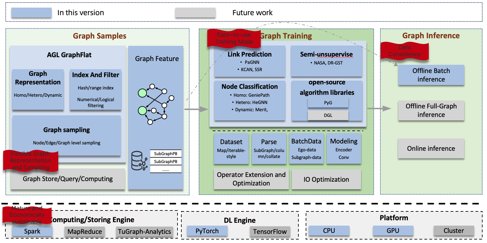

# Ant Graph Learning

[](./LICENSE)

[Website](https://openagl.openfinai.org/en-US)|[中文文档](./README_CN.md)

Ant Graph Learning (AGL) provides a comprehensive solution for graph learning tasks at an industrial scale.

[//]: # (<div align="center">)

[//]: # ()

[//]: # (<br>)

[//]: # (<b>Figure</b>: AGL Overall Architecture)

[//]: # (</div>)



Graph learning tasks in industrial settings exhibit the following characteristics:

* Complex graph data:
    * Large-scale graphs: typically consisting of billions of nodes, tens of billions of edges, and millions of samples.
    * Data dependencies: The computation of a node's embedding relies on the embeddings of its neighboring nodes/edges.
    * Diverse types: homogeneous/heterogeneous/dynamic graph.
* Complex task types:
    * Offline: offline training, offline batch prediction, offline full-graph prediction.
    * Online: online training, online prediction (consistent with offline results).
* Complex usage/scenarios:
    * Multi-tenancy.
    * Diverse usage scenarios: GNN-only, GNN + search and recommendation/multi-modal.
    * Heterogeneous resources: CPU/GPU clusters.

AGL addresses these challenges by adopting the following approaches:

* The Graph scale issue:
    * AGL tackles the problem of data dependencies by transforming large graphs
      into smaller subgraphs in advance.
* Scalability/Extensibility:
    * Graph sampling: conditional filtering (index) + sampling (random/probabilistic, TopK).
    * Graph representation: AGL provides a graph-feature format that is capable of representing homogeneous,
      heterogeneous, and dynamic graphs. Additionally, it supports node-level, edge-level, and graph-level subgraphs,
      allowing for more granular analysis and learning. Furthermore, AGL provides the option to store only the structure
      of the graph,
      which can be beneficial for certain use cases.
    * Graph training: AGL resolves the data dependency problem inherent in graph data, facilitating
      large-scale distributed training through the utilization of mature deep neural network (DNN) training
      architectures such as PS (Parameter Server) and AllReduce. These architectures enable efficient and scalable
      training processes, ensuring the seamless handling of graph data on a distributed scale.
* Stability:
    * Reuse mature Spark or MapReduce (graph sampling phase) and DNN infrastructure for elasticity and fault tolerance.
* Consistency:
    * Sample consistency: graph samples generated offline can be reused for online/offline prediction.
* Resource cost:
    * Graph features can be stored on disk, thereby reducing the memory requirements.

Based on these considerations, AGL has developed comprehensive solutions for graph data construction and learning,
enabling the completion of large-scale graph learning tasks on regular machines or clusters:

* Graph sampling:
    * AGL leverages Spark (or MR) to pre-extract k-hop neighborhood information of target nodes as graph features.
* Graph training:
    * During the training phase, AGL incorporates parsing logic to convert graph features into essential components such
      as the adjacency matrix, node feature matrix, and edge feature matrix, along with other necessary information for
      the model. This seamless integration of graph learning tasks into the regular DNN learning mode allows for the
      convenient reuse of mature technologies and infrastructure typically used in standard DNN workflows.

AGL currently employs PyTorch as its backend and integrates open-source algorithm libraries like PyG to ease the
development process for users.
Furthermore, AGL has developed some in-house graph algorithms, including node classification, edge prediction, and
representation learning, specifically tailored for handling complex graph data in various forms such as homogeneous,
heterogeneous, and dynamic graphs.

# How to use

* [Installation Guide](doc/core/English/install_EN.md)
* [Process Workflow](doc/core/English/process_description_EN.md)
* [Generate Graph Samples](doc/core/English/sampler/0_data_preparation_EN.md)
* [Graph Learning Tutorial](doc/core/English/graph_learning_tutorial_EN.md)

# How to Contribute

* [Contribution Guidelines](doc/core/English/contribution_EN.md)

# Cite

```
@article{zhang13agl,
  title={AGL: A Scalable System for Industrial-purpose Graph Machine Learning},
  author={Zhang, Dalong and Huang, Xin and Liu, Ziqi and Zhou, Jun and Hu, Zhiyang and Song, Xianzheng and Ge, Zhibang and Wang, Lin and Zhang, Zhiqiang and Qi, Yuan},
  journal={Proceedings of the VLDB Endowment},
  volume={13},
  number={12}
}

@inproceedings{zhang2023inferturbo,
  title={InferTurbo: A Scalable System for Boosting Full-graph Inference of Graph Neural Network over Huge Graphs},
  author={Zhang, Dalong and Song, Xianzheng and Hu, Zhiyang and Li, Yang and Tao, Miao and Hu, Binbin and Wang, Lin and Zhang, Zhiqiang and Zhou, Jun},
  booktitle={2023 IEEE 39th International Conference on Data Engineering (ICDE)},
  pages={3235--3247},
  year={2023},
  organization={IEEE Computer Society}
}
```

# License

[Apache License 2.0](LICENSE)
