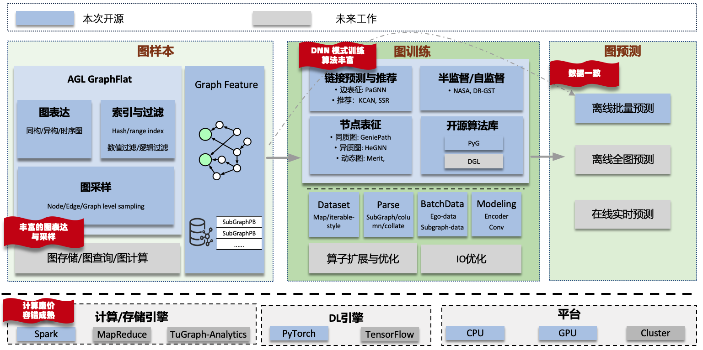

# Ant Graph Learning

[](./LICENSE)

Ant Graph Learning (AGL) 为工业级大规模图学习任务提供全链路解决方案。

[//]: # (<div align="center">)

[//]: # ()

[//]: # (<br>)

[//]: # (<b>Figure</b>: AGL Overall Architecture)

[//]: # (</div>)



工业级图学习任务具有以下特点：

* 图数据复杂：
    * 图数据规模大：典型有 十亿点，百亿边，亿级别样本。
    * 数据依赖：一个点的 embedding 依赖周围点/边的 embedding
    * 类型丰富： 同质/异质/动态图
* 任务类型复杂
    * 离线：离线训练，离线批量预测，离线全图预测
    * 在线：在线训练，在线预测（需要与离线结果一致）
* 使用方式/场景复杂：
    * 多租户
    * 使用方式多变：GNN-only，GNN+搜推广/多模态
    * 异构资源：CPU/GPU cluster

AGL应对这些问题的思路：

* 图规模
    * 图训练：训练时由大图转换为小图，解决数据依赖问题
* 扩展性
    * 图采样：条件过滤（索引） + 采样（随机/概率、TopK）
    * 图表达：graph feature 能够表达 同质/异质/动态图；支持 node/edge/graph level 子图；支持只存储结构
    * 图训练：解除图数据的数据依赖问题，可以复用成熟的DNN训练架构（如 PS, AllReduce） 进行大规模分布式训练
* 稳定性
    * 复用成熟的 Spark or MapReduce (图样本阶段), 以及 DNN 链路基础设施的弹性与容错能力
* 一致性
    * 样本一致性：图样本离线生成，在/离线预测可复用
* 资源成本
    * graph feature 可存储在磁盘上，减少对内存的需求

基于这样的考量，AGL设计了图数据构建以及学习方案，可以在普通的集群上完成大规模图学习任务：

- 图样本：AGL通过 Spark (MR) 预先抽取目标节点的 k阶邻域信息，作为 GraphFeature。


- 图训练：训练阶段提供解析逻辑，把 GraphFeature 转换为模型所需的邻接矩阵，点特征矩阵，边特征矩阵等信息。
  通过这种将图学习任务无缝衔接到普通DNN的学习模式上，能够方便复用普通DNN模式中各种成熟的技术和基础设施。

目前AGL以Pytorch为后端，同时对接了开源算法库（PyG）, 以减少用户开发负担。同时AGL针对复杂的图数据（同质/异质/动态图），沉淀了丰富的自研图算法（点分类/边预测/表征学习等)。

# 如何使用

* [安装说明](doc/core/Chinese/install.md)
* [流程说明](doc/core/Chinese/process_description.md)
* [构建图样本](doc/core/Chinese/sampler/0_data_preparation.md)
* [图学习教程](doc/core/Chinese/graph_learning_tutorial.md)

# 如何贡献代码

* [Contribution Guidelines](doc/core/Chinese/contribution.md)

# Cite

```
@article{zhang13agl,
  title={AGL: A Scalable System for Industrial-purpose Graph Machine Learning},
  author={Zhang, Dalong and Huang, Xin and Liu, Ziqi and Zhou, Jun and Hu, Zhiyang and Song, Xianzheng and Ge, Zhibang and Wang, Lin and Zhang, Zhiqiang and Qi, Yuan},
  journal={Proceedings of the VLDB Endowment},
  volume={13},
  number={12}
}

@inproceedings{zhang2023inferturbo,
  title={InferTurbo: A Scalable System for Boosting Full-graph Inference of Graph Neural Network over Huge Graphs},
  author={Zhang, Dalong and Song, Xianzheng and Hu, Zhiyang and Li, Yang and Tao, Miao and Hu, Binbin and Wang, Lin and Zhang, Zhiqiang and Zhou, Jun},
  booktitle={2023 IEEE 39th International Conference on Data Engineering (ICDE)},
  pages={3235--3247},
  year={2023},
  organization={IEEE Computer Society}
}
```

# License

[Apache License 2.0](LICENSE)
