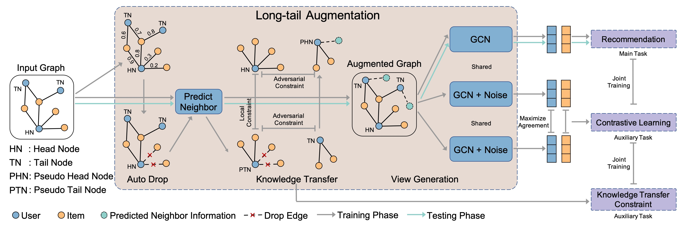
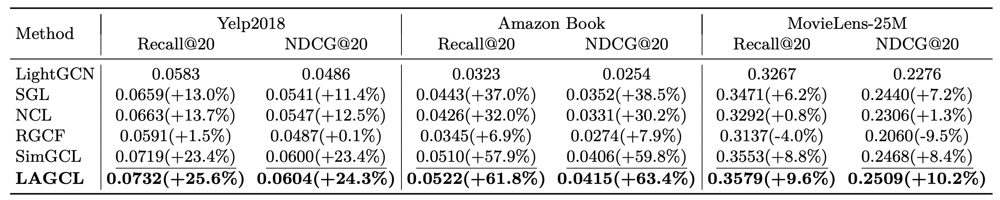
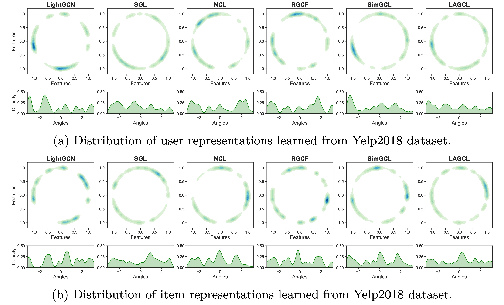

# LAGCL

Source code for "Long-tail Augmented Graph Contrastive Learning for Recommendation" (ECML/PKDD 2023).

## Overview



## Experiments

### The statistics of three datasets

| Dataset       | \#Users | \#Items | \#Interactions | Density |
| ------------- | ------- | ------- | -------------- | ------- |
| Yelp2018      | 31,668  | 38,048  | 1,561,406      | 0.1296% |
| Amazon-Book   | 52,643  | 91,599  | 2,984,108      | 0.0619% |
| Movielens-25M | 155,002 | 27,133  | 3,612,474      | 0.0859% |

### Overall performance comparsion

#### In Paper



#### In this repo (using the same train and test data)

|             | Recall@20 (Paper) | Recall@20 (Recurrence) | NDCG@20 (Paper) | NDCG@20 (Recurrence) |
| ----------- | ----------------- | ---------------------- | --------------- | -------------------- |
| Yelp2018    | 0.0732            | 0.07292                | 0.0604          | 0.06003              |
| Amazon Book | 0.0522            | 0.05249                | 0.0415          | 0.04144              |
| ml-25M      | 0.3579            | 0.35938                | 0.2509          | 0.25370              |
| LastFM      | 0.2737            | 0.30890                | 0.2721          | 0.29995              |

### Distribution uniformity analysis



## Usage

### 1. Envs and Dependencies

```bash

# install dgl
pip install dgl==1.1.1 -f https://data.dgl.ai/wheels/cu117/repo.html
pip install dglgo==0.0.2 -f https://data.dgl.ai/wheels-test/repo.html

# install others
pip install numba==0.57.1
pip install wandb==0.15.8
```

### 2. Processing for Dataset

Download the `ecml_pkdd_2023_lagcl_datasets.zip`
from [here](https://dreamwingscn-my.sharepoint.com/:u:/g/personal/i_dreamwings_cn/EVMzFomyGmxOuJL5eJm0h_QBm0p2SiF6mhETyYvK7tyGsw?e=E6OImX)
, and unzip it to the `data_process/datasets/` directory.

The directory tree of `data_process/datasets/` are below.

```
.
├── amazon-book
│   ├── test.txt
│   └── train.txt
├── lastfm
│   ├── readme.txt
│   ├── split.py
│   ├── test.txt
│   └── train.txt
├── ml-25m
│   ├── README.md
│   ├── split.py
│   ├── test.txt
│   └── train.txt
└── yelp2018
    ├── process.py
    ├── test.txt
    └── train.txt
```

### 3. Training and Evaluation

Run example on Yelp2018 or other datasets with LAGCL Model:

```bash
python agl/python/examples/lagcl_demo/lagcl_full_batch.py --dataset_name lastfm
python agl/python/examples/lagcl_demo/lagcl_full_batch.py --dataset_name yelp2018
```

#### default params

| dataset_name       | lastfm | yelp2018 | amazon-book | ml-25m |
| ------------------ | ------ | -------- | ----------- | ------ |
| batch_size         | 2048   | 2048     | 2048        | 2048   |
| n_hops             | 2      | 2        | 2           | 2      |
| user_num           | 1890   | 31668    | 52643       | 153315 |
| item_num           | 15387  | 38048    | 91599       | 25121  |
| hidden_size        | 64     | 64       | 64          | 64     |
| learning_rate      | 0.001  | 0.001    | 0.001       | 0.001  |
| metric_topk        | 20     | 20       | 20          | 20     |
| epoch              | 50     | 20       | 15          | 6      |
| noise_eps          | 0.1    | 0.1      | 0.1         | 0.2    |
| cl_tau             | 0.2    | 0.2      | 0.2         | 0.2    |
| cl_rate            | 0.1    | 0.5      | 2           | 0.2    |
| tail_k_threshold   | 40     | 20       | 30          | 18     |
| m_h_eps            | 0.01   | 0.001    | 0.001       | 0.1    |
| kl_eps             | 10     | 10       | 10          | 0.1    |
| neighbor_norm_type | both   | left     | left        | both   |
| annealing_type     | 3      | 0        | 1           | 2      |
| agg_function       | 1      | 0        | 0           | 0      |
| lambda_gp          | 1      | 1        | 1           | 1      |
| use_relation_rf    | FALSE  | TRUE     | TRUE        | TRUE   |
| agg_w_exp_scale    | 20     | 20       | 20          | 20     |
| l2_reg             | 0.0001 | 0.0001   | 0.0001      | 0.0001 |

## References

Please cite this repository using the following reference:

```
@inproceedings{zhao-etal-2023-lagcl,
    title = "Long-tail Augmented Graph Contrastive Learning for Recommendation",
    author = "Zhao, Qian and Wu, Zhengwei and Zhang, Zhiqiang and Zhou, Jun",
    booktitle = "European Conference, ECML PKDD 2023",
    year = "2023",
}
```
