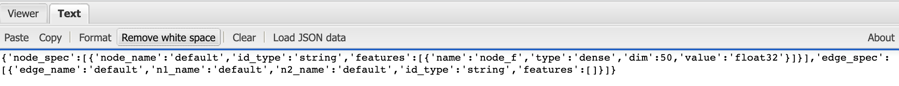
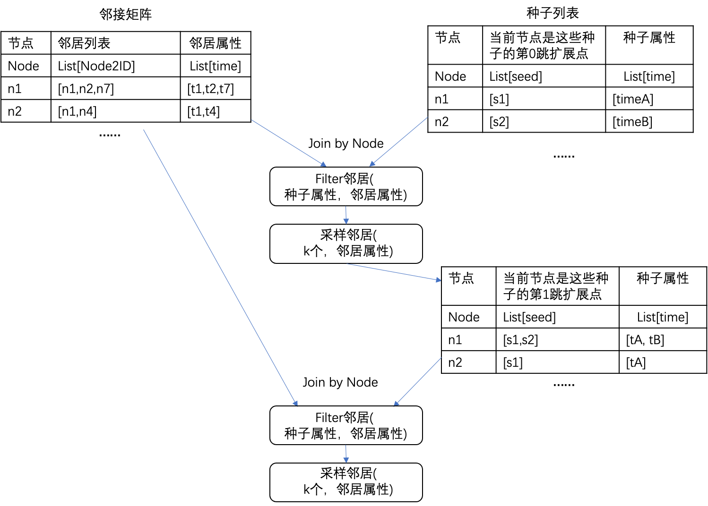

# 快速开始

在项目的example目录下有多种图模型运行案例，下面我们以drgst为例在ind.citeseer数据集上介绍如何快速上手子图采样。

## 图数据准备

### 图数据格式

ind.citeseer图数据点特征为SparkKV特征，边上没有特征。图数据格式如下：

 ``` 
{
  'node_spec': [
    {
      'node_name': 'default',
      'id_type': 'string',
      'features': [
        {
          'name': 'sparse_kv',
          'type': 'kv',
          'dim': 3703,
          'key': 'uint32',
          'value': 'float32'
        }
      ]
    }
  ],
  'edge_spec': [
    {
      'edge_name': 'default',
      'n1_name': 'default',
      'n2_name': 'default',
      'id_type': 'string',
      'features': [
      ]
    }
  ]
}
 ``` 

json线上format工具：http://jsonviewer.stack.hu/

format和 remove white space非常好用，建议json中字符串使用单引号，避免转义麻烦。
format便于观看和编辑，remove white space便于粘贴进配置项或者代码之中。

### 输入数据表

举例输入的点表：

|  node_id   |                        node_feature                        |
| ---------- | ---------------------------------------------------------- |
|     0      |   184:0.032258063554763794 ... 3647:0.032258063554763794   |
|     1      |   82:0.03030303120613098 ... 3640:0.03030303120613098      |
|     2      |   44:0.03999999910593033 ... 3644:0.03999999910593033      |

举例输入的边表：

|  node1_id  |  node2_id  | edge_id |
| ---------- | ---------- | ------- |
|    628     |     0      |  628_0  |
|    158     |     1      |  158_1  |
|    486     |     1      |  486_1  |

样本表如下：

|  node_id  |  seed  |    label     | train_flag  |
| --------- | ------ | ------------ | ----------- |
|    0      |    0   |  0 0 0 1 0 0 |    train    |
|    1      |    1   |  0 1 0 0 0 0 |    eval     |
|    2      |    2   |  0 0 0 0 0 1 |    test     |

## 运行Spark生成子图样本

用户配置spark本地运行命令如下(目前只支持spark3.0.3及以上版本)：

 ``` 
spark-submit  --master local --class com.alipay.alps.flatv3.spark.NodeLevelSampling \
    /path_to/agl.jar hop=2 \
    subgraph_spec="{'node_spec':[{'node_name':'default','id_type':'string','features':[{'name':'sparse_kv','type':'kv','dim':3703,'key':'uint32','value':'float32'}]}],'edge_spec':[{'edge_name':'default','n1_name':'default','n2_name':'default','id_type':'string','features':[]}]}"  \
    sample_cond='random_sampler(limit=100, replacement=false)'   \
    input_node_feature="file:////path_to/node_table.csv" \
    input_edge="file:////path_to/edge_table.csv" \
    input_label="file:////path_to/label.csv" \
    output_results='file:////path_to/output_subgraph' 2>&1 | tee logfile.txt
 ``` 

### 配置说明

|                            配置                           |                 说明              |
| --------------------------------------------------------- | --------------------------------- |
|                      --master local                       |        spark本地运行模式          |
|  --class com.alipay.alps.flatv3.spark.NodeLevelSampling   |      spark程序入口：子图采样      |
|                           hop=2                           |            进行2跳邻居采样          |
|                       subgraph_spec                       |            定义图数据格式           |
|sample_cond="random_sampler(limit=100, replacement=false)" | 限制每个节点无放回的采样最多10个邻居节点 |
| input_node_feature="file:////path_to/node_table.csv"      |    file:///前缀表示后续接着本地路径   |

### 图采样整体流程

下图展示了2跳子图结构采样的扩展过程：



得到子图结构，根节点依赖的点、边信息后，再join点、边特征，生成子图样本。

### 结果数据说明

输出的结果表如下：

|  node_id   |     label    |  train_flag  |  subgraph  |
| ---------- | ------------ | ------------ | ---------- |
|     0      |  0 0 0 1 0 0 |     train    |   0的子图  |
|     1      |  0 1 0 0 0 0 |     eval     |   1的子图  |
|     2      |  0 0 0 0 0 1 |     test     |   2的子图  |
