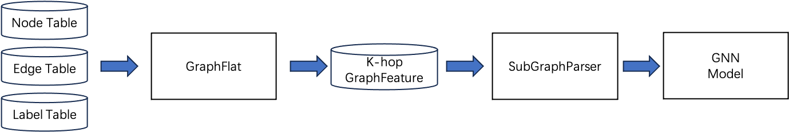

# Process Explanation

## k-hop Neighborhood

Data dependency is a major challenge in training Graph Neural Networks (GNNs).
Typically, the calculation of node embeddings in GNNs depends on their k-hop neighborhood, and neighborhood information
expands exponentially with the number of iteration layers, k.

To address data dependencies in GNNs, AGL utilizes mature solutions like Spark and MapReduce to precompute the k-hop
neighborhood information of nodes.
Therefore, the user workflow consists of first running GraphFlat to build k-hop neighborhood graph features and then
proceeding with model training.

## Graph Samples

GNN's computational paradigm involves message passing abstractions.
GraphFlat builds an efficient distributed k-hop neighborhood generator based on message passing, providing complete
k-hop neighborhood information for each target node.
This means that we don't need to store the entire graph in memory; we only need to load one or a batch of data at a
time.
Thus, the entire training process remains consistent with classical machine learning patterns.

## Graph Training

Based on the guarantee of mutually independent data mentioned above, the training module reads k-hop neighborhood graph
samples and seamlessly reuses various mature technologies and infrastructure available in standard DNN (Deep Neural
Network) models.