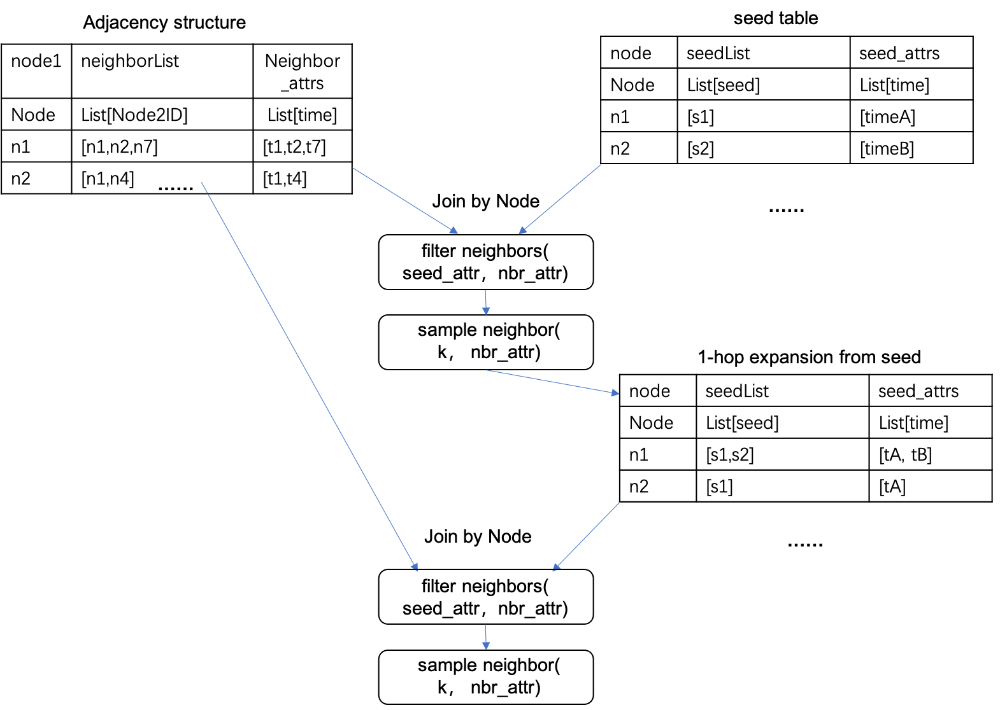

# Quick Start

In the "example" directory of your project, there are various graph model running examples. We will use DRGST as an
example to introduce how to quickly get started with subgraph sampling on the ind.citeseer dataset.

## Graph Data Preparation

### Graph Data Format

The ind.citeseer graph data has node features in the form of SparkKV features, doesn't has features on the edges. The
graph data format is as follows:

```json
{
  'node_spec': [
    {
      'node_name': 'default',
      'id_type': 'string',
      'features': [
        {
          'name': 'sparse_kv',
          'type': 'kv',
          'dim': 3703,
          'key': 'int64',
          'value': 'float32'
        }
      ]
    }
  ],
  'edge_spec': [
    {
      'edge_name': 'default',
      'n1_name': 'default',
      'n2_name': 'default',
      'id_type': 'string',
      'features': [
      ]
    }
  ]
}
```

JSON online format tool: [http://jsonviewer.stack.hu/](http://jsonviewer.stack.hu/)


The "format" and "remove white space" functions are very useful. It is recommended to use single quotes in JSON to avoid
escaping issues.
The "format" function makes it easier to view and edit, and the "removing white space" function makes it easier to paste
it into configuration or code.

### Input Data Tables

Here are examples of input node tables:

| node_id | node_feature                                         |
| ------- | ---------------------------------------------------- |
| 0       | 184:0.032258063554763794 ... 3647:0.032258063554763794 |
| 1       | 82:0.03030303120613098 ... 3640:0.03030303120613098   |
| 2       | 44:0.03999999910593033 ... 3644:0.03999999910593033   |

And here are examples of input edge tables:

| node1_id | node2_id | edge_id |
| -------- | -------- | ------- |
| 628      | 0        | 628_0   |
| 158      | 1        | 158_1   |
| 486      | 1        | 486_1   |

The sample table is as follows:

| node_id | seed | label        | train_flag |
| ------- | ---- | ------------ | ---------- |
| 0       | 0    | 0 0 0 1 0 0  | train      |
| 1       | 1    | 0 1 0 0 0 0  | eval       |
| 2       | 2    | 0 0 0 0 0 1  | test       |

## Running Spark to Generate Subgraph Samples

The user can configure the Spark local execution command as follows (currently only supports Spark 3.0.3 and above):

```shell
spark-submit  --master local --class com.alipay.alps.flatv3.spark.NodeLevelSampling \
    /path_to/agl.jar hop=2 \
    subgraph_spec="{'node_spec':[{'node_name':'default','id_type':'string','features':[{'name':'sparse_kv','type':'kv','dim':3703,'key':'uint32','value':'float32'}]}],'edge_spec':[{'edge_name':'default','n1_name':'default','n2_name':'default','id_type':'string','features':[]}]}"  \
    sample_cond='random_sampler(limit=100, replacement=false)'   \
    input_node_feature="file:////path_to/node_table.csv" \
    input_edge="file:////path_to/edge_table.csv" \
    input_label="file:////path_to/label.csv" \
    output_results='file:////path_to/output_subgraph' 2>&1 | tee logfile.txt
```

### Configuration Explanation

| Configuration                                              | Description                                        |
| ---------------------------------------------------------- | -------------------------------------------------- |
| --master local                                             | Run Spark in local mode                            |
| --class com.alipay.alps.flatv3.spark.NodeLevelSampling     | Spark program entry point for subgraph sampling    |
| hop=2                                                      | Perform 2-hop neighborhood sampling                |
| subgraph_spec                                              | Define the graph data format                        |
| sample_cond="random_sampler(limit=100, replacement=false)" | Limit the sampling to a maximum of 100 neighbors per node without replacement |
| input_node_feature="file:////path_to/node_table.csv"       | Use local file paths for input node features       |
| input_edge="file:////path_to/edge_table.csv"               | Use local file paths for input edge data           |
| input_label="file:////path_to/label.csv"                   | Use local file path for input label data           |
| output_results='file:////path_to/output_subgraph'          | Use local file path for output subgraphs           |

### Overview of Graph Sampling Process

The following diagram illustrates the expansion process of 2-hop subgraph structure sampling:



After obtaining the subgraph structure and the information of nodes and edges that the root node can receive, join the
node and edge features to generate subgraph features.

### Result Data Explanation

The output result table is as follows:

| node_id | label       | train_flag | subgraph   |
| ------- | ----------- | ---------- | ---------- |
| 0       | 0 0 0 1 0 0 | train      | Subgraph of Node 0 |
| 1       | 0 1 0 0 0 0 | eval       | Subgraph of Node 1 |
| 2       | 0 0 0 0 0 1 | test       | Subgraph of Node 2 |
