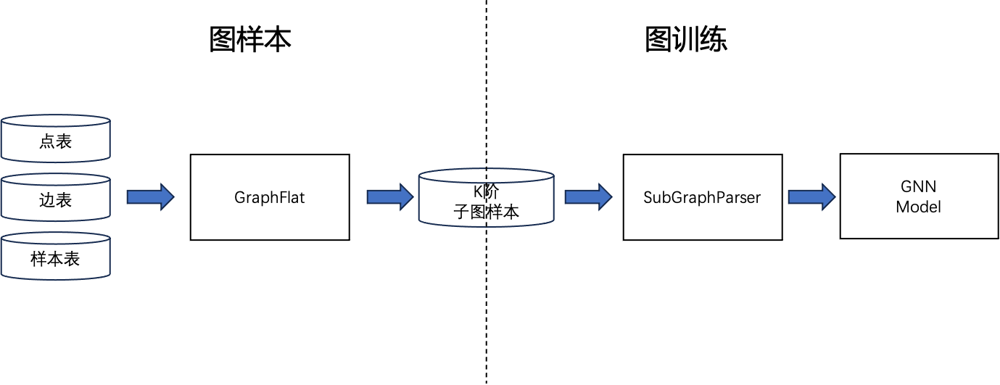

# 流程说明
## k阶邻域
数据依赖是图神经网络训练中的一大难题：通常，图神经网络每个节点 embedding 的计算依赖其 k 阶邻域，邻域信息随着迭代层数 k 指数级扩展

为了解决图神经网络中的数据依赖，AGL 基于成熟的Spark、MapReduce等方案，提前计算节点的 k 阶邻域信息。
因此用户使用流程为：首先运行GraphFlat构建k阶邻域图样本，然后进行模型训练。

## 图样本
GNN计算范式归纳的消息传递元语，GraphFlat 基于消息传递构建高效的分布式K阶邻域生成器，它为训练过程中每个目标节点提供信息完备的k阶邻域信息。因此我们不需要将全图存放在内存中，每次仅需要载入一个或者一个batch的数据。这样，整个训练的过程就和经典的机器学习模式保持一致。

## 图训练
基于上述数据相互独立的保证，训练模块读取 k 阶邻域图样本，无缝衔接复用普通DNN模式中各种成熟的技术和基础设施。
